# 📈 FinSight MCP — Agentic Indian Stock Market Research Assistant

<div align="center">


<br/>

**A production-style implementation of Anthropic's Model Context Protocol (MCP) that transforms a local LLM into an agentic financial research assistant for Indian NSE stocks — built 100% with free and open-source tools.**

*Built after completing the [Anthropic Academy — Introduction to Model Context Protocol](https://anthropic.com) course*

<br/>

[🚀 Quick Start](#-setup-and-installation-macos-m1) · [📸 Screenshots](#-live-demo-screenshots) · [🏗️ Architecture](#%EF%B8%8F-architecture-and-flow-diagram) · [📚 What I Learned](#-what-i-learned)

</div>

---

## 📌 Table of Contents

- [What is This Project?](#-what-is-this-project)
- [Live Demo Screenshots](#-live-demo-screenshots)
- [What is MCP? My Understanding](#-what-is-mcp-my-understanding)
- [Architecture and Flow Diagram](#%EF%B8%8F-architecture-and-flow-diagram)
- [MCP Primitives Implemented](#-mcp-primitives-implemented)
- [Project Structure](#-project-structure)
- [Tech Stack](#-tech-stack-100-free)
- [Setup and Installation](#-setup-and-installation-macos-m1)
- [How to Run](#-how-to-run)
- [Key Implementation Details](#-key-implementation-details)
- [Outcomes and Results](#-outcomes-and-results)
- [What I Learned](#-what-i-learned)
- [Possible Extensions](#-possible-extensions)

---

## 🎯 What is This Project?

FinSight MCP is a **complete, end-to-end implementation** of the Model Context Protocol. It consists of two parts working together:

| Part | File | Role |
|------|------|------|
| **MCP Server** | `finsight_server.py` | Exposes stock market capabilities through all 3 MCP primitives: Tools, Resources, and Prompts |
| **MCP Client** | `finsight_client.py` | Connects to the server, discovers capabilities, runs a conversational chat loop via Ollama LLM |

> **Core insight:** MCP separates *"what the AI can do"* (server) from *"how the AI is used"* (client) — making AI capabilities modular, reusable, and composable across any client.

### Why Indian Stock Market?

I work as a Junior Data Scientist at **Pure Broking Pvt. Ltd.** (a brokerage firm) and have built production RAG systems for regulatory compliance using Anthropic and OpenAI APIs. Combining MCP with Indian financial data made this project authentic to my real-world domain — and immediately legible to fintech/AI recruiters.

---

## 📸 Live Demo Screenshots

### 1. MCP Inspector — Server Connection

> The MCP Inspector is a developer tool that connects directly to your MCP server to browse and test all tools, resources, and prompts — no client needed. Think **Postman, but for MCP servers**.

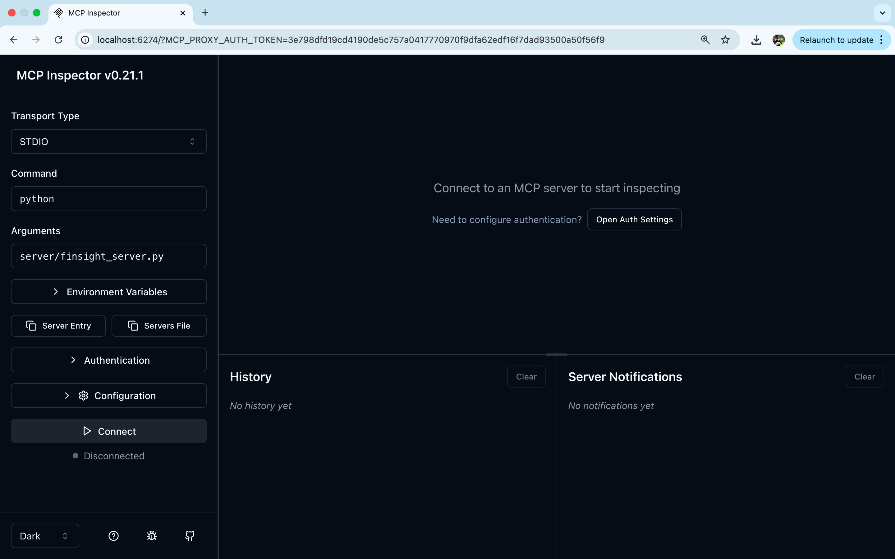

*Inspector launched with Transport: STDIO. Clicking Connect spawns the server subprocess and discovers all capabilities.*

---

### 2. All Three MCP Primitives — One Screen

> Typing `tools` calls `list_tools()`, `list_resources()`, and `list_prompts()` on the server simultaneously — proving complete discovery of all three MCP primitives.

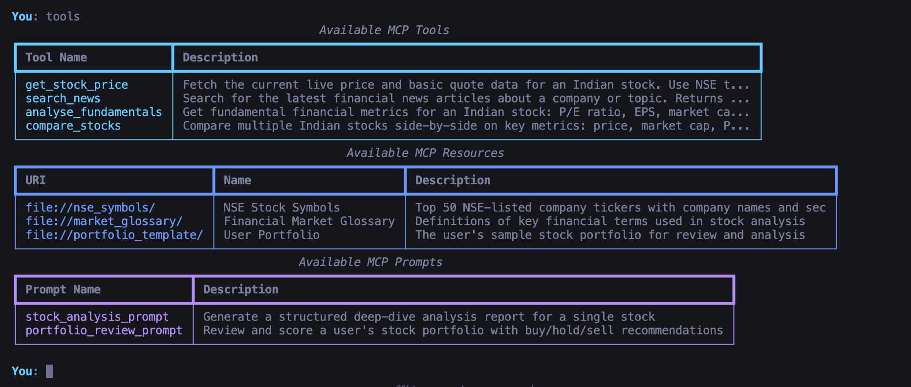

| Column | What it shows |
|--------|--------------|
| **Tools** | 4 callable functions the LLM can invoke |
| **Resources** | 3 context files served at file:// URIs |
| **Prompts** | 2 parameterised server-side templates |

---

### 3. Live Tool Execution — Real-Time Stock Price

> "What is the current price of TCS?" → keyword router fires → `get_stock_price(ticker="TCS.NS")` → live JSON → LLM summarises.

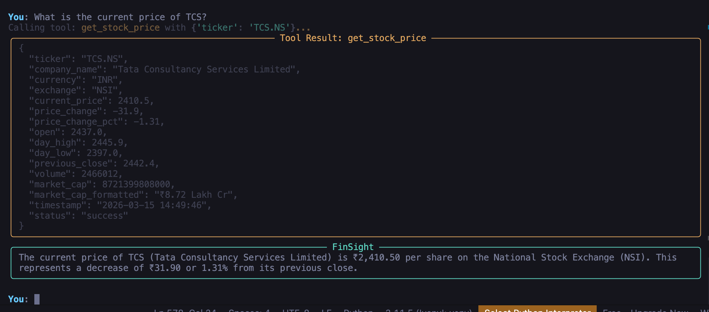

**Live result:** TCS at **₹2,410.50 (−1.31%)** · Market Cap **₹8.72 Lakh Cr** · Timestamp `2026-03-15 14:49:46`

---

### 4. Multi-Stock Comparison

> "Compare TCS, Infosys, and Wipro" → `compare_stocks(["TCS.NS","INFY.NS","WIPRO.NS"])` → side-by-side metrics + auto-rankings.

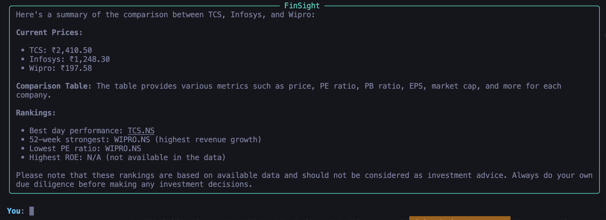

**Result:** TCS ₹2,410 · Infosys ₹1,248 · Wipro ₹197 — with winner detection across P/E, ROE, 52-week performance.

---

### 5. MCP Prompt Template — Deep Analysis Report

> `analyse RELIANCE.NS` → fetches `stock_analysis_prompt` from server → fills `{{ticker}}` + `{{timeframe}}` → auto-calls 2 tools → LLM generates 8-section report.

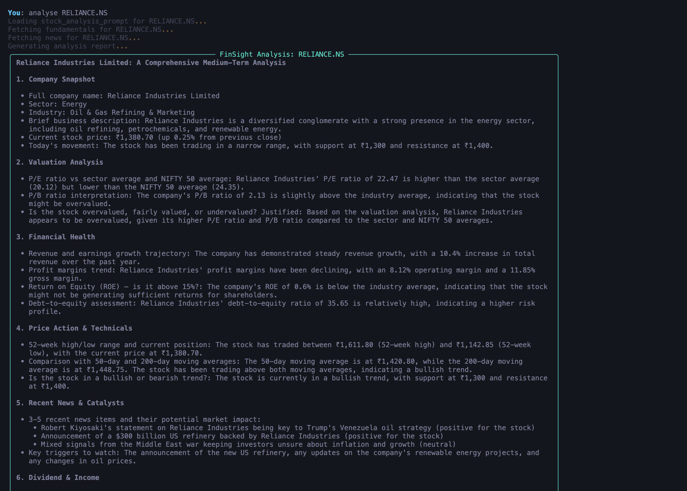

**Result:** Full structured report — P/E 22.47, ROE 0.6%, D/E 35.65, 52W range ₹1,142–₹1,611, news catalysts, investment verdict.

---

## 🧠 What is MCP? My Understanding

### The Problem MCP Solves

Before MCP, every AI application built its own custom glue layer between the LLM and external tools. Want Claude to query your database? Custom code. Want GPT-4 to query the same database? Rewrite it entirely. No standard existed.

> **MCP is the USB-C of AI tool integrations** — a universal protocol so any MCP client (Claude Desktop, custom Python, VS Code) can plug into any MCP server (databases, APIs, file systems) without custom integration code.

### The Three MCP Primitives

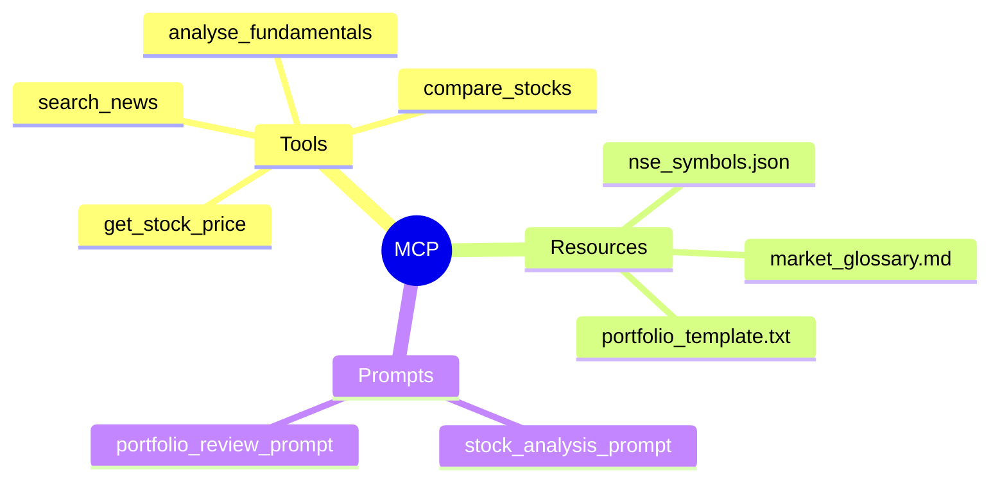

| Primitive | Analogy | When to use | Example here |
|-----------|---------|-------------|-------------|
| **Tools** | API endpoint | Real-time data, actions with side effects | Live stock price from yfinance |
| **Resources** | Reference manual | Static context injected into LLM memory | Finance glossary, NSE symbol list |
| **Prompts** | Workflow template | Reusable, parameterised LLM workflows | 8-section analysis report |

### MCP Communication Protocol

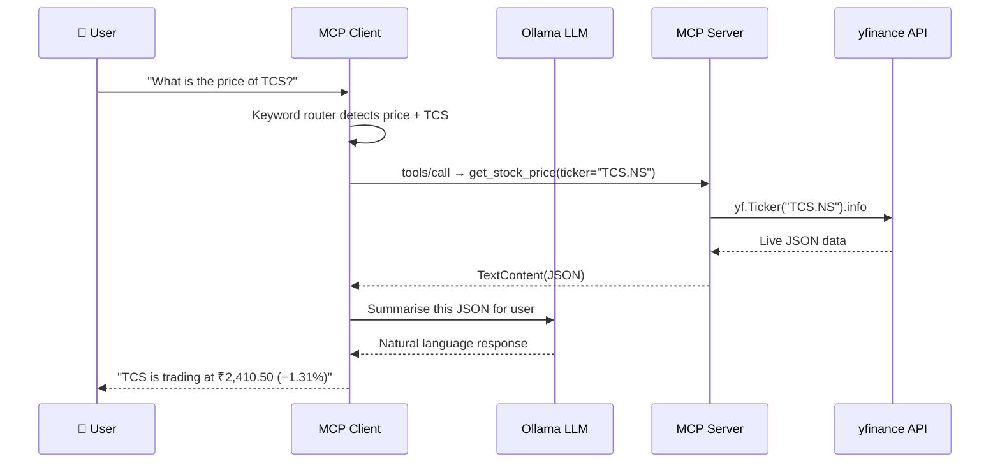

---

## 🏗️ Architecture and Flow Diagram

### Full System Architecture

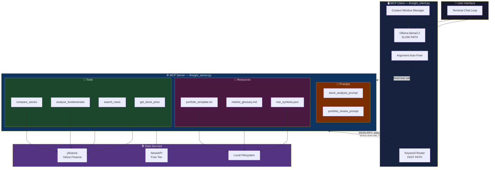

---

### Request Flow — Simple Price Query

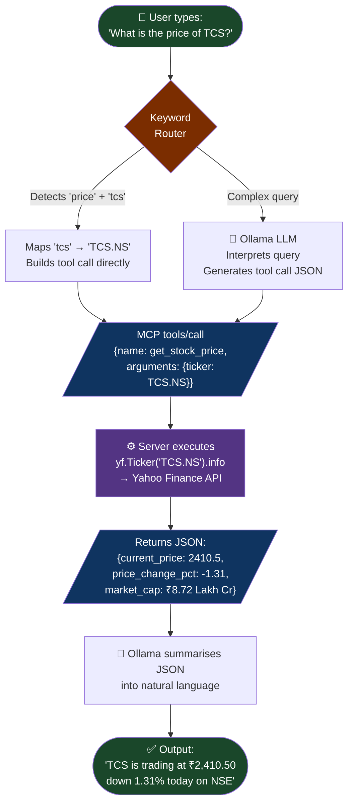

---

### Prompt Template Flow — `analyse RELIANCE.NS`

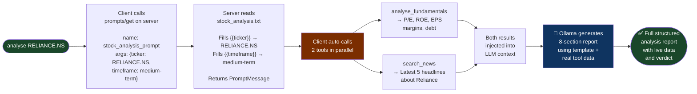

---

### MCP Session Lifecycle

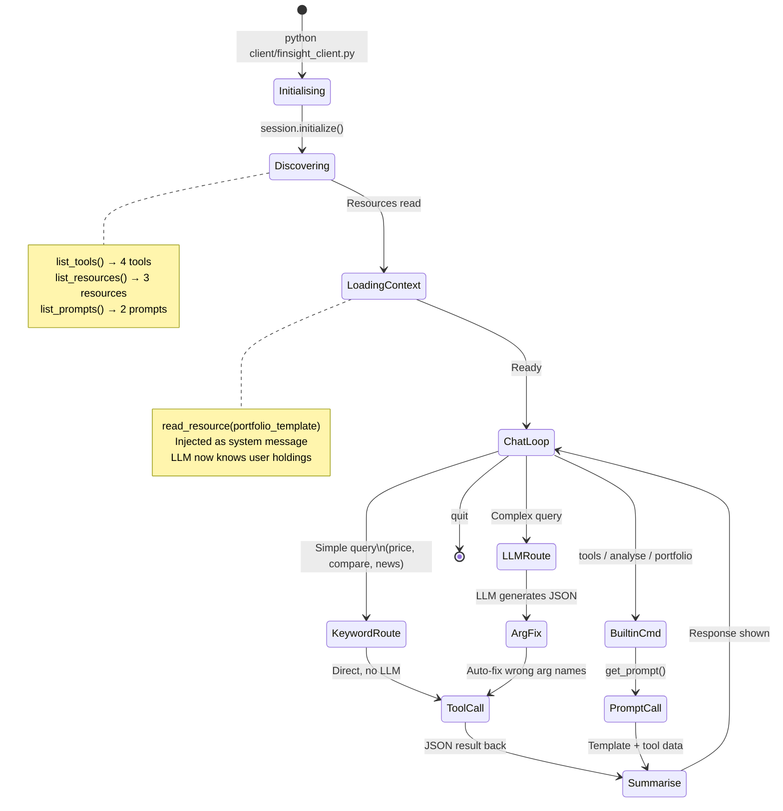

---

## 🧩 MCP Primitives Implemented

### Tools (4 total)

Tools are **executable functions** the LLM can call with structured, schema-validated arguments.

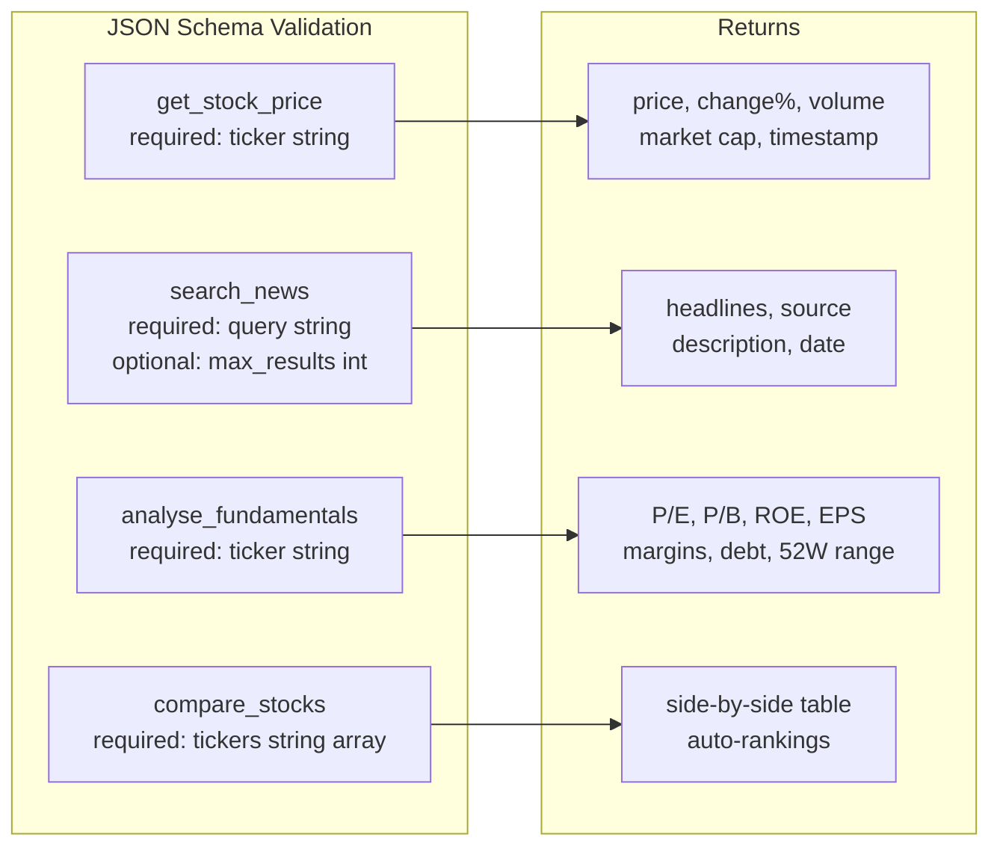

```python
# How a tool is registered on the server
@app.list_tools()
async def list_tools() -> list[types.Tool]:
    return [
        types.Tool(
            name="get_stock_price",
            description="Fetch the current live price for an Indian NSE stock. "
                        "Use NSE ticker format: TCS.NS, RELIANCE.NS, INFY.NS",
            inputSchema={
                "type": "object",
                "properties": {
                    "ticker": {
                        "type": "string",
                        "description": "NSE ticker symbol e.g. TCS.NS"
                    }
                },
                "required": ["ticker"]
            }
        )
    ]
```

---

### Resources (3 total)

Resources are **read-only context files** — loaded once, injected into LLM memory.

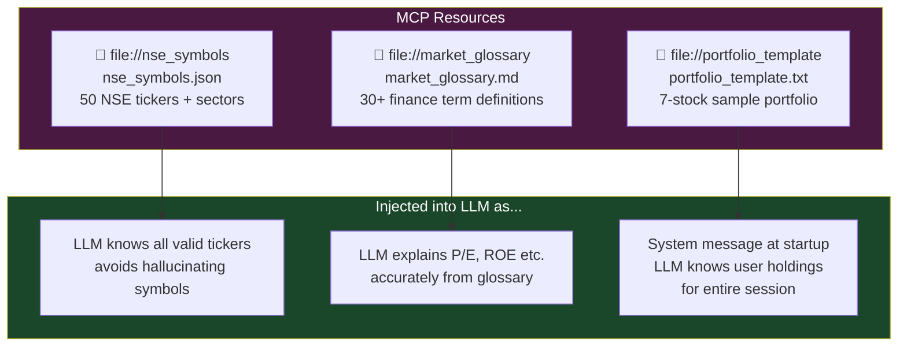

> **Key insight:** Resources avoid re-fetching static data on every request. Load once → inject → LLM remembers throughout the session.

---

### Prompts (2 total)

Prompts are **parameterised workflow templates** stored on the server — the most powerful and most underused MCP primitive.

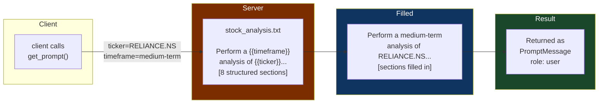

> **Why this matters:** Any MCP client — Claude Desktop, VS Code, a mobile app — can trigger the same structured analysis workflow with a single `get_prompt()` call. The workflow logic lives on the server, not in the client.

---

## 📁 Project Structure

```
finsight-mcp/
│
├── 📂 server/                        ← MCP Server  (the "what")
│   ├── finsight_server.py            ← Tools + Resources + Prompts registered here
│   ├── 📂 tools/
│   │   ├── stock_price.py            ← get_stock_price  (yfinance)
│   │   ├── news_search.py            ← search_news      (NewsAPI + yfinance fallback)
│   │   ├── fundamentals.py           ← analyse_fundamentals  (50+ metrics)
│   │   └── compare_stocks.py         ← compare_stocks   (multi-ticker, auto-ranked)
│   └── 📂 resources/
│       ├── nse_symbols.json          ← 50 NSE tickers + company names + sectors
│       ├── market_glossary.md        ← 30+ financial term definitions
│       └── portfolio_template.txt    ← 7-stock sample user portfolio
│
├── 📂 client/
│   └── finsight_client.py            ← MCP Client  (the "how")
│                                        • Keyword router (fast path)
│                                        • Ollama integration (slow path)
│                                        • Argument name auto-fixer
│                                        • Context window management
│
├── 📂 prompts/
│   ├── stock_analysis.txt            ← 8-section deep analysis template
│   └── portfolio_review.txt          ← Portfolio score + buy/hold/sell template
│
├── 📂 tests/
│   └── test_tools.py                 ← Unit tests for all 4 tools
│
├── 📂 screenshots/                   ← Demo screenshots for this README
├── .env.example                      ← Config template (Ollama model, NewsAPI key)
├── requirements.txt
└── README.md
```

---

## 🛠️ Tech Stack (100% Free)

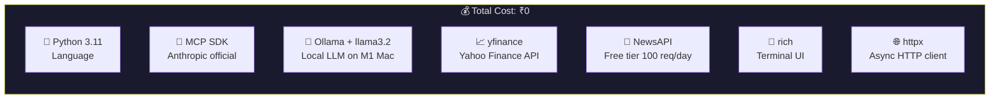

| Component | Technology | Why chosen |
|-----------|-----------|------------|
| MCP Framework | `mcp` Python SDK (Anthropic official) | Official SDK, best practices built-in |
| Local LLM | Ollama + llama3.2 | Runs on M1 Mac, no API cost, fast |
| Stock Data | `yfinance` | Free, NSE supported, no rate limits |
| News | NewsAPI free + yfinance fallback | Graceful degradation if no key |
| Terminal UI | `rich` | Tables, markdown, colour-coded panels |
| HTTP | `httpx` async | Non-blocking Ollama communication |

---

## 🚀 Setup and Installation (macOS M1)

### Prerequisites

```bash
# 1. Homebrew
/bin/bash -c "$(curl -fsSL https://raw.githubusercontent.com/Homebrew/install/HEAD/install.sh)"

# 2. Python 3.11
brew install python@3.11 && python3 --version

# 3. Ollama (local LLM runtime)
brew install ollama

# 4. Node.js (for MCP Inspector)
brew install node
```

### Project Setup

```bash
git clone https://github.com/Akash-47-tank/finsight-mcp.git
cd finsight-mcp

python3 -m venv venv && source venv/bin/activate
pip install -r requirements.txt
cp .env.example .env
```

### Download LLM Model (one-time, ~2GB)

```bash
# Terminal 1 — keep running
ollama serve

# Terminal 2
ollama pull llama3.2
ollama list    # confirm it appears
```

---

## ▶️ How to Run

### Option 1 — Full Chat Client

```bash
# Terminal 1: keep Ollama running
ollama serve

# Terminal 2: launch FinSight
source venv/bin/activate
python client/finsight_client.py
```

**Available commands:**

| Command | MCP Primitive Used | What happens |
|---------|-------------------|--------------|
| `tools` | list_tools + list_resources + list_prompts | Shows all server capabilities |
| `What is the price of TCS?` | Tool → `get_stock_price` | Live NSE price |
| `Compare TCS and Infosys` | Tool → `compare_stocks` | Side-by-side metrics |
| `News about Reliance` | Tool → `search_news` | Recent headlines |
| `analyse RELIANCE.NS` | Prompt → `stock_analysis_prompt` + 2 tools | 8-section report |
| `portfolio` | Prompt → `portfolio_review_prompt` + Resource | Portfolio score |
| `What does P/E mean?` | Resource (glossary in context) | LLM answers accurately |

### Option 2 — MCP Inspector (Developer View)

```bash
npx @modelcontextprotocol/inspector python server/finsight_server.py
# Open http://localhost:5173
```

### Option 3 — Run Tests

```bash
python tests/test_tools.py
```

---

## 🔑 Key Implementation Details

### Dual-Path Tool Routing

The most important engineering decision in this project. Local LLMs (`llama3.2`) sometimes generate wrong argument names — e.g., `{"param": "TCS.NS"}` instead of `{"ticker": "TCS.NS"}`. I solved it with two layers of defence:

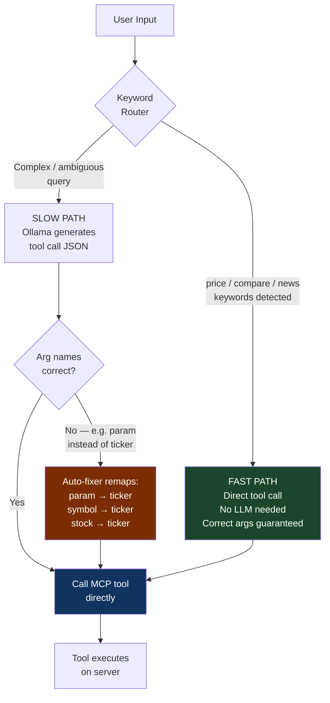

```python
# Auto-fixer in extract_tool_call()
wrong_keys = {"param", "symbol", "stock", "ticker_symbol", "stock_ticker"}
for wrong in wrong_keys:
    if wrong in args and "ticker" not in args:
        args["ticker"] = args.pop(wrong)   # remap silently
```

### Context Window Management

```python
# Always keep system prompts + last 20 messages
if len(messages) > 22:
    messages = messages[:2] + messages[-20:]
```

### Portfolio Resource Injection at Startup

```python
# Loaded ONCE — stays in LLM context for entire session
portfolio = await session.read_resource("file://portfolio_template")
messages.append({
    "role": "system",
    "content": f"USER PORTFOLIO:\n{portfolio_text}"
})
# LLM now knows all 7 holdings throughout the conversation
```

---

## 📊 Outcomes and Results

### All Features Verified Working

| Feature | MCP Primitive | Status | Actual Output |
|---------|--------------|--------|--------------|
| Live stock price | Tool | ✅ | TCS ₹2,410.50 (−1.31%) |
| Stock comparison | Tool | ✅ | TCS vs Infosys vs Wipro ranked table |
| Fundamentals analysis | Tool | ✅ | P/E 22.47, ROE 0.6%, D/E 35.65 |
| Financial news | Tool | ✅ | Recent headlines with source + date |
| NSE symbol context | Resource | ✅ | 50 companies loaded at startup |
| Finance glossary | Resource | ✅ | LLM explains terms from loaded context |
| Portfolio context | Resource | ✅ | 7 holdings injected as system memory |
| Deep analysis report | Prompt + 2 Tools | ✅ | 8-section Reliance report |
| Portfolio review | Prompt + Resource | ✅ | Scored review with recommendations |
| MCP Inspector | All 3 primitives | ✅ | All browsable and testable |

### Reliance Industries — Actual Analysis Output

```
Price    : ₹1,380.70 (+0.25%)
P/E      : 22.47  vs sector avg 20.12  → slightly overvalued
ROE      : 0.6%   (below 15% ideal)    → concern flagged
D/E      : 35.65                        → high leverage
52W Range: ₹1,142 – ₹1,611
Trend    : Bullish (above 50 DMA ₹1,420 and 200 DMA ₹1,448)
News     : $300B US refinery · Venezuela oil strategy
Verdict  : Overvalued on P/E and P/B vs sector peers
```

---

## 📚 What I Learned

### 1. stdio Transport Is Simpler Than It Sounds
The stdio transport spawns the server as a child process and uses stdin/stdout pipes for JSON-RPC 2.0 messages. Server `print()` goes to stderr — MCP messages go to stdout. Keeping these separate was the key to debugging without breaking the protocol.

### 2. Tool Schema Quality Directly Controls LLM Behaviour
The JSON Schema is exactly what the LLM reads to understand how to call a tool. Vague schemas → wrong argument names. I learned to always put a concrete example in the `description` field (`"e.g. TCS.NS, RELIANCE.NS"`) — not just abstract descriptions.

### 3. Resources vs Tools — Choosing Correctly Matters
- **Resources** = context that doesn't change per request (glossary, symbol lists, user profile)
- **Tools** = actions that need real-time data or have side effects (live prices, news search)
- Using a Tool to serve a static glossary wastes a round-trip. Using a Resource for live prices returns stale data.

### 4. MCP Prompts Enable Composable AI Workflows
Server-side Prompts encode **standardised workflows** that any MCP client can trigger. The stock analysis workflow (template → 2 tool calls → LLM report) can be triggered from Claude Desktop, a VS Code extension, or a mobile app — without rewriting the workflow logic in each client.

### 5. Local LLMs Require Defensive Engineering
`llama3.2` on M1 is fast and capable, but occasionally outputs wrong argument names. I built both a keyword router (avoid the LLM entirely for simple queries) and an argument auto-fixer (correct wrong names silently). Production agentic systems need **validation layers**, not just prompting.

### 6. The Server-Client Separation Is the Core Value
The MCP server has zero knowledge of Ollama. The client has zero knowledge of yfinance. They communicate only through the MCP protocol. Practical consequence:
- Swap Ollama → Claude API? Zero server changes.
- Swap yfinance → Bloomberg? Zero client changes.
- Add a VS Code extension as a second client? Zero server changes.

This modularity is what makes MCP a genuine architectural standard, not just a library.

---

## 🔮 Possible Extensions

| Extension | Effort | What it adds |
|-----------|--------|-------------|
| Streamlit Web UI | Medium | Replace terminal with browser interface |
| Historical price charts | Low | `get_price_history` tool + matplotlib |
| BSE support | Low | Add BSE-listed tickers alongside NSE |
| Portfolio P&L tracker | Medium | Track buy prices, show real gain/loss |
| SSE transport | Medium | Deploy server remotely, not just local |
| Claude API | Low | Swap Ollama for Anthropic Claude in production |
| Multi-server client | High | Connect to stocks + news + macro MCP servers simultaneously |

---

## ⚠️ Disclaimer

For **educational purposes only**. Nothing produced by this application constitutes financial advice. Always consult a SEBI-registered investment advisor before making investment decisions.

---

## 📄 License

MIT License — free to use, modify, and distribute with attribution.

---

<div align="center">

**Built to demonstrate complete Model Context Protocol (MCP) implementation skills.**

*Anthropic Academy — Introduction to MCP course project*

⭐ Star this repo if it helped you understand MCP

**[github.com/Akash-47-tank/finsight-mcp](https://github.com/Akash-47-tank/finsight-mcp)**

</div>
